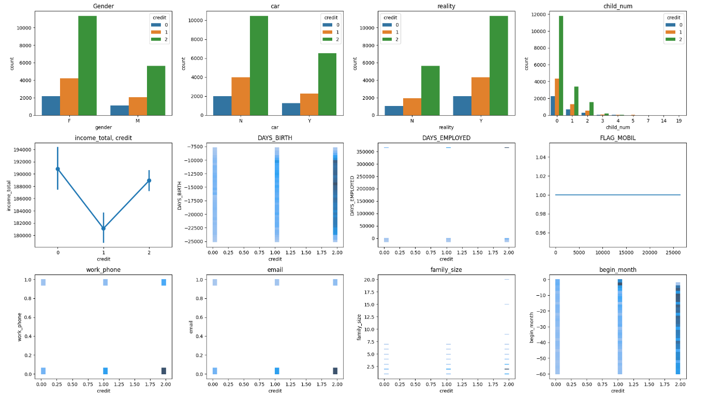

# 데이크루 6기
https://dacon.io/competitions/official/236116/overview/description

신용카드 사용자 연체 예측 

 

## 1. 배경 & 목적

- 배경

    신용카드 사용의 확산과 함께 연체 문제는 금융 기관과 사용자 모두에게 중요한 이슈로 대두되고 있습니다. 특히, 연체 가능성이 높은 사용자를 조기에 식별하고 관리하는 것은 금융 기관의 리스크 관리 및 고객 만족도 향상에 필수적입니다. 이러한 연체 문제를 효과적으로 관리하기 위해, 예측 모델을 활용하여 연체 가능성을 미리 예측하고 적절한 대응 방안을 마련하는 것이 중요합니다.

- 목적

     - 연체 가능성 예측 및 관리: 개인별 연체 가능성을 예측하는 모델을 개발하여, 연체 가능성이 높은 사용자를 조기에 식별하고 관리할 수 있는 체계를 구축합니다.
     - 예방과 대응을 통한 위험 관리: 예측 모델을 활용하여 위험한 사용자를 식별하고 사전 조치를 통해 리스크를 최소화합니다.
     - 서비스 개선 및 만족도 향상: 낮은 연체 가능성의 고객을 대상으로 특별 서비스를 제공함으로써 고객 만족도를 높이고, 서비스 경험을 개선합니다.
     - 개인 신용 점수 향상: 개인 신용 점수 관리 지원을 통해 고객에게 더 나은 금융 거래 기회를 제공하고, 전반적인 신용 리스크를 낮추는 데 기여합니다.

 

## 2. 주최/주관 & 팀원

- 주최/주관: DACON
- 팀원: 나대경, 이지훈, 임태경

 

## 3. 프로젝트 기간

- 2023.07. ~ 2023.08. (2주)

 

## 4. 프로젝트 소개

 이번 프로젝트의 목표는 신용카드 사용자들이 연체할 가능성을 예측하는 것입니다. 이를 위해 다양한 분류 모델을 활용하여 분석하고, 성능을 비교한 후 최적의 모델을 선택하여 최종 예측 모델을 구축하는 과정으로 진행되었습니다.

- 데이터 이해 및 전처리
  - 데이터셋: 주어진 데이터에는 성별, 차량 소유 여부, 부동산 소유 여부, 자녀 수, 연간 소득, 소득 유형, 교육 수준, 결혼 여부, 생활 방식 등 다양한 변수가 포함되어 있었습니다.
  - 결측치 처리: occyp_type (직업 유형) 변수는 약 50%의 결측치를 포함하고 있었으며, 이는 삭제되었습니다.
  - 데이터 정규화: 소득, 고용 기간 등의 변수는 값이 매우 커서 MinMaxScaler를 이용하여 0과 1 사이로 정규화하였습니다.
  - 파생 변수 생성: 나이를 기준으로 20대부터 60대까지의 파생 변수를 생성하였습니다.
  - 레이블 인코딩: 범주형 변수는 LabelEncoder를 사용하여 인코딩하였습니다.
  - 데이터 불균형 처리: SMOTE 오버샘플링 기법을 사용하여 클래스 간 불균형을 해결하였습니다.

- 데이터 시각화 및 분석

    시각화 과정에서 Seaborn 라이브러리를 주로 사용하였으며, 이는 Matplotlib을 기반으로 한 데이터 시각화 라이브러리로 고급 인터페이스를 제공합니다.
    

    - 분석 내용

            - 성별 : 남성보단 여성에서 연체의 경우가 많다.
            - 자동차 유무 : 자동차가 없는 사람이 더 많으며, 연체의 경우도 더 높다
            - 부동산 유무 : 부동산을 가지고 있는 경우 연체의 경향이 더 높다
            - 자녀 수 : 자녀가 없는 사람이 연체의 비율이 압도적으로 높다. ( 아마 20대의 영향이 클 수도 있고, 신혼의 경우 대출만 있을 수도 있기 때문 )
            - 연간 소득 : 연간 소득이 높을 수록 안정적인 신용과, 연체 신용 두 부분에서 높게 보여졌다. 반대로 연간 소득이 낮을 경우 적당한 신용을 가지고 있다.
            - 출생일 : 그림으로 결과를 유추하기 어려움. (양수 : 고용되지않은 상태, 음수 : 고용시작일(점점 작아짐))
            - FLAG_MOBIL : 핸드폰 소유 여부 - 모두 소유 하고있으므로 차후 제거 필요
            - work phone : 업무용 전화 소유 여부 - 업무용 핸드폰이 없는 경우에 신용이 더  낮아짐을 확인할 수 있음
            - email : 개인 이메일을 소유하고 있지 않은 사람이 신용이 더 낮은 경향을 확인할 수 있음
            - family_size : 가족 규모 : 0,1,2의 경우에 가족규모가 클 수록 신용이 낮은 경향이 있지만, 모든 클래스에 대해 골고루 분포해있음. - 데이터 삭제해도 될 가능성이 있다.
            - begin_month : 신용카드 발급 월 - 신용이 낮은 사람의 경우 신용카드 발급 월에 상관없이 골고루 분포함을 보임

- 모델링

  5개의 모델을 비교하여 최종 모델을 선택하였습니다.

1. XGBoost Classifier

   - 그리드 서치(Grid Search) 활용: XGBoost 모델의 성능을 극대화하기 위해 그리드 서치를 사용하여 하이퍼파라미터를 최적화하였습니다. 그리드 서치를 통해 탐색한 하이퍼파라미터는 max_depth, learning_rate, gamma, min_child_weight, subsample, colsample_bytree 등입니다.
   - 최적화된 하이퍼파라미터: 그리드 서치 결과, max_depth=16, learning_rate=0.3, gamma=0.2, min_child_weight=1, colsample_bytree=0.9, subsample=0.9, n_estimators=100이 최적의 성능을 보였습니다.
   - 정확도: 0.752 -> 0.781

   
   
2. AdaBoost Classifier

   - 기본 파라미터로 실행.
   - 정확도: 0.519

   

3. RandomForest Classifier

   - 그리드 서치(Grid Search) 활용: RandomForest 모델의 성능을 최적화하기 위해 n_estimators, min_samples_split 등의 하이퍼파라미터에 대해 그리드 서치를 수행하였습니다.
   - 정확도: 0.759 -> 0.766

   

4. SVC

   - 기본 파라미터로 실행.
   - 정확도: 0.489

   

5. LightGBM Classifier

   - 그리드 서치(Grid Search) 활용: LightGBM 모델에 대해 그리드 서치를 적용하여 max_depth, n_estimators, num_leaves 등의 하이퍼파라미터를 최적화하였습니다.
   - 정확도: 0.783

   

- 결론

    이번 프로젝트에서 다양한 모델을 비교해본 결과, XGBoost, RandomForest, LightGBM 모델이 가장 높은 성능을 보였습니다. 특히, 그리드 서치를 활용한 하이퍼파라미터 최적화 과정을 통해 XGBoost와 LightGBM 모델의 성능을 극대화할 수 있었으며, RandomForest 또한 우수한 성능을 보여주었습니다.

    이를 통해 신용카드 사용자 연체 예측에 있어서 이 모델들이 유용하게 사용될 수 있음을 확인할 수 있었습니다. 최종적으로 이 중 가장 성능이 높은 모델을 선택해 실제 데이터에 적용할 수 있는 모델을 구축할 수 있었습니다.

 

## 5. 프로젝트 담당 역할

- 데이터 분석 및 시각화

     - 데이터 전처리 후, 주요 변수들(성별, 자동차 소유 여부, 부동산 소유 여부, 자녀 수, 연간 소득 등)에 대한 시각화를 통해 변수 간의 관계 및 타겟 변수와의 상관관계 분석
     - Seaborn 라이브러리를 활용하여 countplot, pointplot, histplot 등을 사용한 다양한 시각화 작업 수행
     - 분석 결과를 통해 주요 변수와 연체 가능성 간의 상관관계를 파악하여 모델링에 반영

- XGBoost 모델 개발 및 성능 최적화

     - 그리드 서치(Grid Search)를 활용하여 XGBoost 모델의 하이퍼파라미터 최적화
     - 주요 하이퍼파라미터(max_depth, learning_rate, gamma, min_child_weight 등)를 튜닝하여 모델 성능 극대화
     - 최종적으로 최적화된 XGBoost 모델로 예측 성능을 0.781까지 향상

- RandomForest 모델 개발 및 성능 최적화

     - 그리드 서치를 통해 RandomForest 모델의 n_estimators, min_samples_split 등의 하이퍼파라미터 최적화
     - 최적화된 모델로 정확도를 0.766까지 향상시켜 경쟁력 있는 모델 구축

 